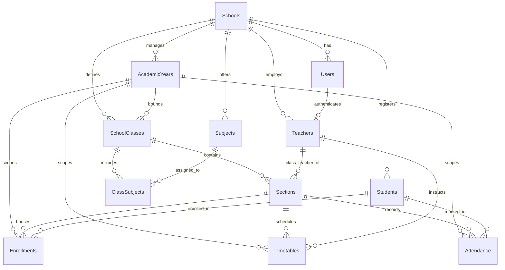

# Database Schema & Relational Specifications — Schema v2

## 1. Overview & SQLite Configuration

The local data layer is powered by **[Drift](https://drift.simonbinder.eu/)** over **SQLite 3**, engineered for high reliability, atomic multi-step transactions, and zero-data-loss durability in offline environments.

SQLite is configured with the following hardening pragmas:

- **Write-Ahead Logging (WAL) Mode**: `PRAGMA journal_mode = WAL;` enabled on database open. Allows concurrent readers while writes execute, minimizes disk write amplification, and prevents file locking conflicts.
- **Busy Timeout**: `PRAGMA busy_timeout = 5000;` ensures background write operations wait up to 5,000ms if the database is momentarily busy, eliminating `SQLITE_BUSY` contention errors.
- **Foreign Keys Enabled**: `PRAGMA foreign_keys = ON;` executed unconditionally on every database open to ensure relational integrity at the SQLite engine level.
- **Background Worker Isolate**: Queries and batch mutations execute off the UI thread via `NativeDatabase.createInBackground(file)`.
- **Primary Keys**: Universally Unique Identifiers (UUID v4 strings) across all tables to eliminate collision risks during future multi-device synchronization.
- **Timestamps**: UTC ISO 8601 strings (`YYYY-MM-DDTHH:MM:SS.mmmZ`) for deterministic auditing and synchronization conflict resolution.
- **Soft Deletion (`isArchived` & `archivedAt`)**: Entities are archived rather than destructively purged, preserving historical academic records, enrollments, and attendance integrity.

---

## 2. Schema Migration: v1 to v2

Drift's `MigrationStrategy` safely upgrades v1 databases to v2 on app boot without data loss:

```dart
@override
MigrationStrategy get migration => MigrationStrategy(
  onCreate: (m) async {
    await m.createAll();
  },
  onUpgrade: (m, from, to) async {
    if (from < 2) {
      // Add soft-delete archiving columns across core entities
      await m.addColumn(academicYears, academicYears.isArchived);
      await m.addColumn(academicYears, academicYears.archivedAt);

      await m.addColumn(schoolClasses, schoolClasses.isArchived);
      await m.addColumn(schoolClasses, schoolClasses.archivedAt);

      await m.addColumn(sections, sections.isArchived);
      await m.addColumn(sections, sections.archivedAt);

      await m.addColumn(subjects, subjects.isArchived);
      await m.addColumn(subjects, subjects.archivedAt);

      await m.addColumn(teachers, teachers.isArchived);
      await m.addColumn(teachers, teachers.archivedAt);

      await m.addColumn(students, students.isArchived);
      await m.addColumn(students, students.archivedAt);

      await m.addColumn(enrollments, enrollments.isArchived);
      await m.addColumn(enrollments, enrollments.archivedAt);
    }
  },
  beforeOpen: (details) async {
    await customStatement('PRAGMA foreign_keys = ON;');
    await customStatement('PRAGMA journal_mode = WAL;');
    await customStatement('PRAGMA busy_timeout = 5000;');
  },
);
```

---

## 3. Table Specifications

### 3.1 `Schools`

Represents the single institutional tenant residing on this device.
| Column | Type | Constraints | Description |
|---|---|---|---|
| `id` | `TEXT` | PK | UUID v4 |
| `name` | `TEXT` | NOT NULL | Official school name |
| `code` | `TEXT` | NOT NULL, UNIQUE | Identifier (e.g. `SCH-001`) |
| `address` | `TEXT` | NULLABLE | Physical location / municipality |
| `phone` | `TEXT` | NULLABLE | Primary contact phone number |
| `email` | `TEXT` | NULLABLE | Contact email |
| `principal_name` | `TEXT` | NULLABLE | Head of school name |
| `logo_path` | `TEXT` | NULLABLE | Local file path to school emblem |
| `created_at` | `TEXT` | NOT NULL | Creation timestamp |
| `updated_at` | `TEXT` | NOT NULL | Last modification timestamp |

---

### 3.2 `Users`

Local user credentials and role definitions. Plaintext passwords are never persisted.
| Column | Type | Constraints | Description |
|---|---|---|---|
| `id` | `TEXT` | PK | UUID v4 |
| `school_id` | `TEXT` | FK -> `Schools.id` | Associated school |
| `username` | `TEXT` | NOT NULL, UNIQUE | Login handle |
| `password_hash` | `TEXT` | NOT NULL | Salted SHA-256 hash |
| `salt` | `TEXT` | NOT NULL | Cryptographic 32-byte hex salt |
| `name` | `TEXT` | NOT NULL | Full name of user |
| `email` | `TEXT` | NULLABLE | Notification or backup email |
| `role` | `TEXT` | NOT NULL | `admin`, `teacher`, `accountant` |
| `is_active` | `INTEGER` | NOT NULL, DEFAULT 1 | 1 = Active, 0 = Disabled |
| `created_at` | `TEXT` | NOT NULL | Creation timestamp |
| `updated_at` | `TEXT` | NOT NULL | Last modification timestamp |

---

### 3.3 `AcademicYears`

School sessions. Only one year may be active (`is_current = 1`) at any given time.
| Column | Type | Constraints | Description |
|---|---|---|---|
| `id` | `TEXT` | PK | UUID v4 |
| `school_id` | `TEXT` | FK -> `Schools.id` | Associated school |
| `name` | `TEXT` | NOT NULL | Session label (e.g. `2026/27`) |
| `start_date` | `TEXT` | NOT NULL | ISO date string (`2026-04-01`) |
| `end_date` | `TEXT` | NOT NULL | ISO date string (`2027-03-31`) |
| `is_current` | `INTEGER` | NOT NULL, DEFAULT 0 | 1 = Current active academic year |
| `is_archived` | `INTEGER` | NOT NULL, DEFAULT 0 | 1 = Archived (soft-deleted) |
| `archived_at` | `TEXT` | NULLABLE | Timestamp of archive action |
| `created_at` | `TEXT` | NOT NULL | Creation timestamp |
| `updated_at` | `TEXT` | NOT NULL | Last modification timestamp |

---

### 3.4 `SchoolClasses`

Grade levels defined within an academic year (e.g. Grade 6, Grade 10).
| Column | Type | Constraints | Description |
|---|---|---|---|
| `id` | `TEXT` | PK | UUID v4 |
| `school_id` | `TEXT` | FK -> `Schools.id` | Associated school |
| `academic_year_id` | `TEXT` | FK -> `AcademicYears.id` | Associated academic session |
| `name` | `TEXT` | NOT NULL | Grade title (e.g. `Grade 10`) |
| `display_order` | `INTEGER` | NOT NULL, DEFAULT 0 | Sorting sequence in UI |
| `is_archived` | `INTEGER` | NOT NULL, DEFAULT 0 | 1 = Archived |
| `archived_at` | `TEXT` | NULLABLE | Timestamp of archive action |
| `created_at` | `TEXT` | NOT NULL | Creation timestamp |
| `updated_at` | `TEXT` | NOT NULL | Last modification timestamp |

---

### 3.5 `Sections`

Class divisions (e.g. Section A, Section B).
| Column | Type | Constraints | Description |
|---|---|---|---|
| `id` | `TEXT` | PK | UUID v4 |
| `class_id` | `TEXT` | FK -> `SchoolClasses.id` (CASCADE) | Parent class |
| `name` | `TEXT` | NOT NULL | Section name (e.g. `Section A`) |
| `capacity` | `INTEGER` | NOT NULL, DEFAULT 40 | Maximum student limit |
| `class_teacher_id` | `TEXT` | NULLABLE, FK -> `Teachers.id` | Assigned class teacher |
| `is_archived` | `INTEGER` | NOT NULL, DEFAULT 0 | 1 = Archived |
| `archived_at` | `TEXT` | NULLABLE | Timestamp of archive action |
| `created_at` | `TEXT` | NOT NULL | Creation timestamp |
| `updated_at` | `TEXT` | NOT NULL | Last modification timestamp |

---

### 3.6 `Subjects`

Institutional course catalog.
| Column | Type | Constraints | Description |
|---|---|---|---|
| `id` | `TEXT` | PK | UUID v4 |
| `school_id` | `TEXT` | FK -> `Schools.id` | Associated school |
| `name` | `TEXT` | NOT NULL | Course title (e.g. `Mathematics`) |
| `code` | `TEXT` | NOT NULL, UNIQUE | Course code (e.g. `MATH10`) |
| `description` | `TEXT` | NULLABLE | Syllabus overview |
| `is_active` | `INTEGER` | NOT NULL, DEFAULT 1 | 1 = Active, 0 = Inactive |
| `is_archived` | `INTEGER` | NOT NULL, DEFAULT 0 | 1 = Archived |
| `archived_at` | `TEXT` | NULLABLE | Timestamp of archive action |
| `created_at` | `TEXT` | NOT NULL | Creation timestamp |
| `updated_at` | `TEXT` | NOT NULL | Last modification timestamp |

---

### 3.7 `ClassSubjects`

Join table mapping subjects taught in a specific grade.
| Column | Type | Constraints | Description |
|---|---|---|---|
| `id` | `TEXT` | PK | UUID v4 |
| `class_id` | `TEXT` | FK -> `SchoolClasses.id` (CASCADE) | Associated class |
| `subject_id` | `TEXT` | FK -> `Subjects.id` (CASCADE) | Associated subject |
| `created_at` | `TEXT` | NOT NULL | Creation timestamp |

---

### 3.8 `Teachers`

Faculty profiles with optional login user linkage.
| Column | Type | Constraints | Description |
|---|---|---|---|
| `id` | `TEXT` | PK | UUID v4 |
| `school_id` | `TEXT` | FK -> `Schools.id` | Associated school |
| `user_id` | `TEXT` | NULLABLE, FK -> `Users.id` | Linked local account |
| `employee_code` | `TEXT` | NOT NULL, UNIQUE | Unique employee identifier |
| `name` | `TEXT` | NOT NULL | Full faculty name |
| `phone` | `TEXT` | NULLABLE | Primary phone |
| `email` | `TEXT` | NULLABLE | Contact email |
| `address` | `TEXT` | NULLABLE | Residence address |
| `is_active` | `INTEGER` | NOT NULL, DEFAULT 1 | 1 = Active, 0 = Inactive |
| `is_archived` | `INTEGER` | NOT NULL, DEFAULT 0 | 1 = Archived |
| `archived_at` | `TEXT` | NULLABLE | Timestamp of archive action |
| `created_at` | `TEXT` | NOT NULL | Creation timestamp |
| `updated_at` | `TEXT` | NOT NULL | Last modification timestamp |

---

### 3.9 `Students`

Permanent student biodata registry.
| Column | Type | Constraints | Description |
|---|---|---|---|
| `id` | `TEXT` | PK | UUID v4 |
| `school_id` | `TEXT` | FK -> `Schools.id` | Associated school |
| `student_code` | `TEXT` | NOT NULL, UNIQUE | Institutional admission number |
| `first_name` | `TEXT` | NOT NULL | First name |
| `middle_name` | `TEXT` | NULLABLE | Middle name |
| `last_name` | `TEXT` | NOT NULL | Surname / Last name |
| `gender` | `TEXT` | NOT NULL | `Male`, `Female`, `Other` |
| `date_of_birth` | `TEXT` | NULLABLE | ISO date string |
| `address` | `TEXT` | NULLABLE | Residential address |
| `guardian_name` | `TEXT` | NULLABLE | Parent or legal guardian |
| `guardian_phone` | `TEXT` | NULLABLE | Contact phone |
| `is_active` | `INTEGER` | NOT NULL, DEFAULT 1 | 1 = Active, 0 = Inactive |
| `is_archived` | `INTEGER` | NOT NULL, DEFAULT 0 | 1 = Archived (soft-deleted) |
| `archived_at` | `TEXT` | NULLABLE | Timestamp of archive action |
| `created_at` | `TEXT` | NOT NULL | Creation timestamp |
| `updated_at` | `TEXT` | NOT NULL | Last modification timestamp |

---

### 3.10 `Enrollments`

Decouples permanent student records from annual class/section placement.
| Column | Type | Constraints | Description |
|---|---|---|---|
| `id` | `TEXT` | PK | UUID v4 |
| `school_id` | `TEXT` | FK -> `Schools.id` | Associated school |
| `student_id` | `TEXT` | FK -> `Students.id` (CASCADE) | Enrolled student |
| `academic_year_id` | `TEXT` | FK -> `AcademicYears.id` (CASCADE) | Academic session |
| `class_id` | `TEXT` | FK -> `SchoolClasses.id` | Class level |
| `section_id` | `TEXT` | FK -> `Sections.id` | Section division |
| `roll_number` | `INTEGER` | NULLABLE | Roll number within section |
| `is_archived` | `INTEGER` | NOT NULL, DEFAULT 0 | 1 = Archived |
| `archived_at` | `TEXT` | NULLABLE | Timestamp of archive action |
| `created_at` | `TEXT` | NOT NULL | Creation timestamp |
| `updated_at` | `TEXT` | NOT NULL | Last modification timestamp |

---

### 3.11 `Timetables`

Weekly timetable schedule slots.
| Column | Type | Constraints | Description |
|---|---|---|---|
| `id` | `TEXT` | PK | UUID v4 |
| `school_id` | `TEXT` | FK -> `Schools.id` | Associated school |
| `academic_year_id` | `TEXT` | FK -> `AcademicYears.id` | Academic session |
| `class_id` | `TEXT` | FK -> `SchoolClasses.id` | Class |
| `section_id` | `TEXT` | FK -> `Sections.id` | Section |
| `subject_id` | `TEXT` | FK -> `Subjects.id` | Subject taught |
| `teacher_id` | `TEXT` | NULLABLE, FK -> `Teachers.id` | Assigned instructor |
| `day_of_week` | `INTEGER` | NOT NULL | `1` (Monday) to `7` (Sunday) |
| `period` | `INTEGER` | NOT NULL | Period order (1..8) |
| `start_time` | `TEXT` | NOT NULL | `HH:mm` format (e.g. `09:00`) |
| `end_time` | `TEXT` | NOT NULL | `HH:mm` format (e.g. `09:45`) |
| `room` | `TEXT` | NULLABLE | Classroom / Lab designation |
| `created_at` | `TEXT` | NOT NULL | Creation timestamp |
| `updated_at` | `TEXT` | NOT NULL | Last modification timestamp |

---

### 3.12 `Attendance`

Daily student attendance entries. Protected by composite unique index `(date, student_id, class_id, section_id)`.
| Column | Type | Constraints | Description |
|---|---|---|---|
| `id` | `TEXT` | PK | UUID v4 |
| `school_id` | `TEXT` | FK -> `Schools.id` | Associated school |
| `academic_year_id` | `TEXT` | FK -> `AcademicYears.id` | Academic session |
| `class_id` | `TEXT` | FK -> `SchoolClasses.id` | Class |
| `section_id` | `TEXT` | FK -> `Sections.id` | Section |
| `student_id` | `TEXT` | FK -> `Students.id` | Student marked |
| `date` | `TEXT` | NOT NULL | ISO date string (`YYYY-MM-DD`) |
| `status` | `TEXT` | NOT NULL | `present`, `absent`, `late`, `excused` |
| `remarks` | `TEXT` | NULLABLE | Reason or notes |
| `recorded_by_user_id` | `TEXT` | NULLABLE, FK -> `Users.id` | User who logged record |
| `created_at` | `TEXT` | NOT NULL | Creation timestamp |
| `updated_at` | `TEXT` | NOT NULL | Last modification timestamp |

---

### 3.13 `AuditLogs`

Immutable system-wide operation history.
| Column | Type | Constraints | Description |
|---|---|---|---|
| `id` | `TEXT` | PK | UUID v4 |
| `action` | `TEXT` | NOT NULL | Action constant (e.g. `STUDENT_CREATED`, `STUDENT_ARCHIVED`, `BACKUP_EXPORT`) |
| `entity_type` | `TEXT` | NOT NULL | Target table name (e.g. `Student`, `Timetable`) |
| `entity_id` | `TEXT` | NOT NULL | UUID of affected entity |
| `details` | `TEXT` | NULLABLE | JSON string with delta or parameters |
| `user_id` | `TEXT` | NULLABLE, FK -> `Users.id` | Operating user |
| `timestamp` | `TEXT` | NOT NULL | ISO 8601 UTC timestamp |

---

### 3.14 `AppSettings`

Generic key-value table for device-specific preferences and persistence markers.
| Column | Type | Constraints | Description |
|---|---|---|---|
| `key` | `TEXT` | PK | Unique configuration key (e.g. `active_session_user_id`, `last_backup_timestamp`) |
| `value` | `TEXT` | NOT NULL | Stored value or serialized JSON |
| `updated_at` | `TEXT` | NOT NULL | Last update timestamp |

---

## 4. Relational Entity Diagram


